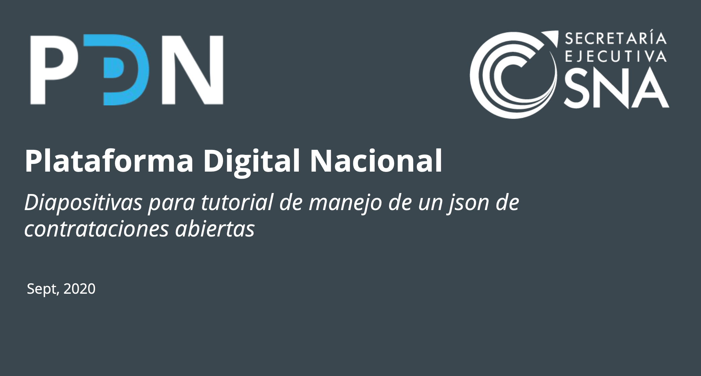
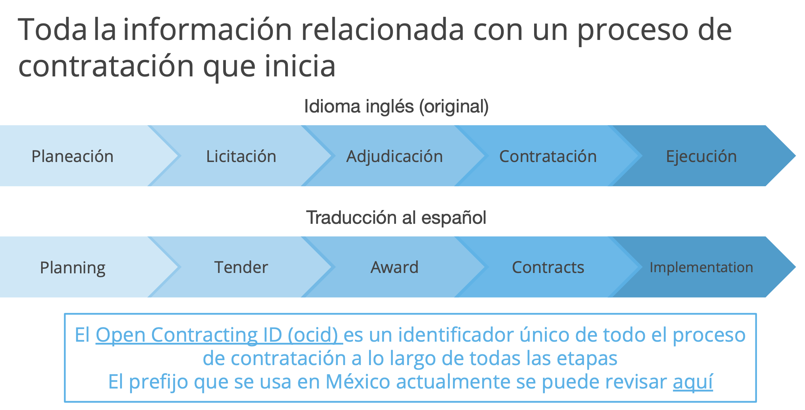
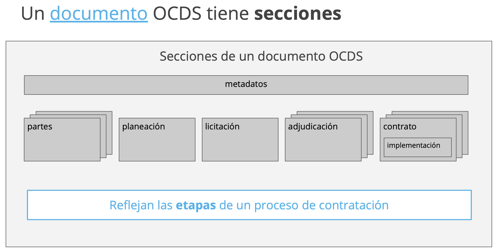

# Tutorial EDCA
Video tutorial y presentación de introducción al Estandar de Datos de Contrataciones Abiertas
y procesamiento básico de archivos en formato JSON.

- [Ver video](https://youtu.be/j485evbqy1Y)
- [Descargar presentación](EDCA_tutorialjson.pdf)
- [Ejercicio](Ejerciciojson.pdf)

## Capturas 
||||
|----|----|----|
||||

